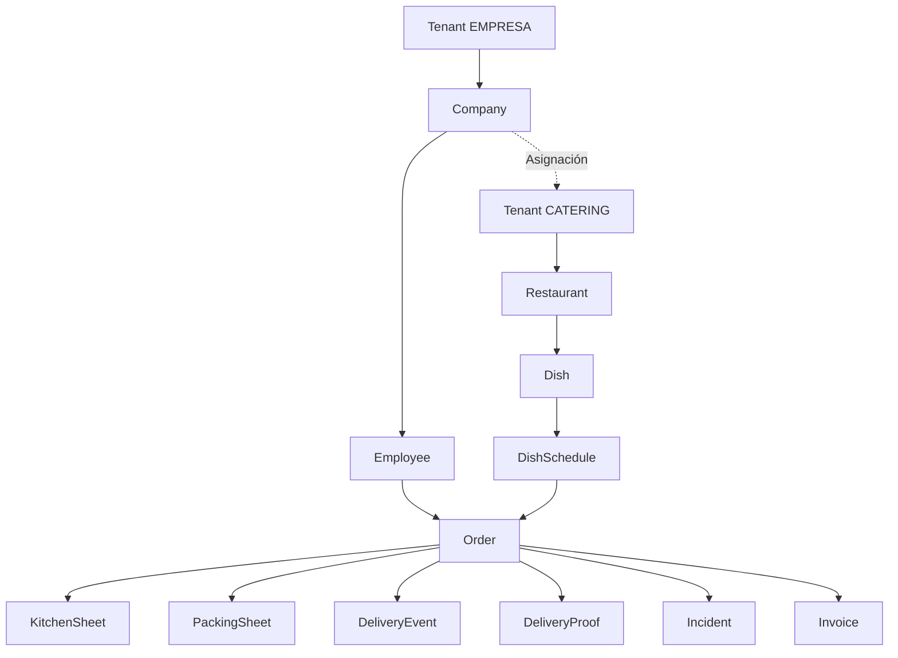

# Portal del Catering - Matriz de Dependencias

## 📋 Índice

1. [Dependencias de Base de Datos](#dependencias-de-base-de-datos)
2. [Dependencias entre Portales](#dependencias-entre-portales)
3. [Dependencias de Componentes](#dependencias-de-componentes)
4. [Dependencias de Queries](#dependencias-de-queries)
5. [Flujos Cross-Portal](#flujos-cross-portal)

---

## 🗄️ Dependencias de Base de Datos

### Tablas Principales del Portal Catering

| Tabla | Dependencias | Relación | Uso en Portal Catering |
|-------|--------------|----------|------------------------|
| **Tenant** | - | Base | Información del catering (tenant.type = CATERING) |
| **Restaurant** | Tenant | 1:1 | Datos operativos, capacidad, zonas, SLAs |
| **User** | Tenant | N:1 | Usuarios del catering (ADMIN_CATERING, CHEF, etc.) |
| **RestaurantDocument** | Restaurant | N:1 | Documentos sanitarios, RC, manipuladores |
| **Dish** | Restaurant | N:1 | Catálogo de platos (primeros, segundos, postres) |
| **DishSchedule** | Dish | N:1 | Menús publicados por día |
| **Order** | Employee, DishSchedule | N:N | Pedidos a preparar/entregar |
| **KitchenSheet** | Order | 1:N | Consolidado para cocina (post-cutoff) |
| **PackingSheet** | Order | 1:N | Consolidado para reparto por empresa |
| **DeliveryEvent** | Order | N:1 | Tracking de entregas (PACKED → DELIVERED) |
| **DeliveryProof** | Order | 1:1 | Justificante de entrega (foto + GPS) |
| **Incident** | Order, Company | N:1 | Incidencias reportadas por empresas/empleados |
| **Invoice** | Order | 1:N | Facturas mensuales por empresa |
| **InvoiceLine** | Invoice, Order | N:1 | Detalle línea a línea |
| **CompanyCateringAssignment** | Company, Tenant | N:N | Relación empresa ↔ catering |
| **AuditLog** | - | Append-only | Trazabilidad de todas las acciones |

### Relaciones Multi-Tenant Críticas



---

## 🔗 Dependencias entre Portales

### Portal Empleado → Portal Catering

| Acción Empleado | Impacto en Catering | Tabla |
|-----------------|---------------------|-------|
| Selecciona menú | Aparece en producción | `Order` (CONFIRMED) |
| Cancela antes cutoff | Se resta de producción | `Order` (CANCELLED_BEFORE_CUTOFF) |
| Marca alergia | Alerta en cocina | `Employee.dietPrefs` → Producción |
| Reporta incidencia | Entra en board catering | `Incident` (OPEN) |
| Valora pedido | Afecta KPIs catering | `OrderRating` |

### Portal Empresa → Portal Catering

| Acción Empresa | Impacto en Catering | Tabla |
|----------------|---------------------|-------|
| Valida incidencia | Actualiza status | `Incident` (IN_PROGRESS) |
| Solicita compensación | Ajusta factura | `Incident.resolution` |
| Descarga factura | Marca como enviada | `Invoice` (SENT) |
| Cambia punto entrega | Actualiza ruta | `CompanySite` |
| Añade empleado | Aumenta capacidad necesaria | `Employee` |

### Portal Catering → Portal Empresa

| Acción Catering | Impacto en Empresa | Tabla |
|-----------------|---------------------|-------|
| Marca entregado | Actualiza estado | `Order` (DELIVERED) |
| Sube evidencia | Justificante disponible | `DeliveryProof` |
| Resuelve incidencia | Notificación empresa | `Incident` (RESOLVED) |
| Genera factura | Disponible para descarga | `Invoice` (ISSUED) |
| Cancela día | Notificación empresas | `DishSchedule` (HIDDEN) |

### Portal Catering → Portal Empleado

| Acción Catering | Impacto en Empleado | Tabla |
|-----------------|---------------------|-------|
| Publica menú semanal | Disponible para selección | `DishSchedule` (PUBLISHED) |
| Cambia plato día | Notificación si ya pedido | `DishSchedule.dishId` |
| Marca entregado | Actualiza historial | `Order` (DELIVERED) |
| Responde incidencia | Notificación empleado | `Incident` |

---

## 🎨 Dependencias de Componentes

### Componentes Reutilizables 100%

| Componente | Origen | Uso en Catering | Ruta |
|------------|--------|-----------------|------|
| `KPICard` | Admin | Dashboard KPIs | `/components/admin/dashboard/KPICard.tsx` |
| `AlertsPanel` | Admin | Alertas dashboard | `/components/admin/dashboard/AlertsPanel.tsx` |
| `ChartsSection` | Admin | Gráficas | `/components/admin/dashboard/ChartsSection.tsx` |
| `Button` | shadcn | Todo | `/components/ui/button.tsx` |
| `Card` | shadcn | Todo | `/components/ui/card.tsx` |
| `Table` | shadcn | Listas | `/components/ui/table.tsx` |
| `Dialog` | shadcn | Modales | `/components/ui/dialog.tsx` |
| `Select` | shadcn | Selects | `/components/ui/select.tsx` |
| `Form` | shadcn | Formularios | `/components/ui/form.tsx` |
| `Badge` | shadcn | Estados | `/components/ui/badge.tsx` |
| `AllergenSelector` | Empleado | Gestión platos | `/components/empleado/perfil/AllergenSelector.tsx` |

### Componentes Adaptables

| Componente | Origen | Adaptación Necesaria | Uso en Catering |
|------------|--------|----------------------|-----------------|
| `OrdersFilters` | Empresa | Cambiar filtros | `ProductionFilters`, `DeliveryFilters` |
| `OrderDetailOverview` | Empresa | Añadir datos cocina | `ProductionDetailView` |
| `BillingKPIs` | Empresa | Invertir lógica (catering cobra) | `InvoicingKPIs` |
| `IncidentsKPIs` | Empresa | Vista catering | `IncidentsKPIsCatering` |
| `IncidentsList` | Empresa | Añadir acciones catering | `IncidentsBoardCatering` |

### Componentes Nuevos Específicos

| Componente | Fase | Descripción | Dependencias |
|------------|------|-------------|--------------|
| `CateringNavbar` | 1 | Navbar con menú catering | `Button`, `Avatar`, `Dropdown` |
| `CateringSidebar` | 1 | Sidebar con navegación | `Button`, `Badge` (notificaciones) |
| `ProductionSheet` | 4 | Vista consolidado cocina | `Card`, `Table`, `Badge` |
| `DishForm` | 2 | Formulario CRUD platos | `Form`, `Input`, `Select`, `AllergenSelector` |
| `WeeklyMenuCalendar` | 3 | Calendario menús | `Calendar`, `Card`, `Badge` |
| `DeliveryRouteCard` | 5 | Tarjeta ruta entrega | `Card`, `Table`, `Button` |
| `DeliveryProofModal` | 5 | Modal subir evidencia | `Dialog`, `Form`, upload component |
| `IncidentsBoard` | 6 | Kanban incidencias | `Card`, `Badge`, drag-drop |
| `InvoiceGenerator` | 7 | Generador facturas | `Form`, `Table`, preview PDF |
| `AuditLogTable` | 7 | Tabla auditoría | `Table`, filtros, diff viewer |

---

## 🔍 Dependencias de Queries

### Queries Existentes (Reutilizables)

| Query | Archivo | Uso en Catering |
|-------|---------|-----------------|
| `getCateringById(tenantId)` | `caterings.ts` | Dashboard base |
| `getCaterings(filters)` | `caterings.ts` | Admin (no catering) |
| `createCatering(data)` | `caterings.ts` | Admin (no catering) |
| `updateCatering(tenantId, data)` | `caterings.ts` | Configuración |

### Queries Nuevas por Módulo

#### Dashboard (Fase 1)
```typescript
// Archivo: /lib/db/queries/catering-dashboard.ts
getCateringDashboard(tenantId: string)
  ↳ Requiere: Restaurant, Order, Incident, KitchenSheet
  ↳ Retorna: KPIs, alertas, actividad reciente

getCateringKPIs(tenantId: string, period: DateRange)
  ↳ Requiere: Order, DeliveryEvent, Incident
  ↳ Retorna: Métricas agregadas
```

#### Platos (Fase 2)
```typescript
// Archivo: /lib/db/queries/catering-dishes.ts
getDishes(tenantId: string, filters: DishFilters)
  ↳ Requiere: Dish, DishSchedule (count)
  ↳ Retorna: Lista paginada

getDishById(dishId: string)
  ↳ Requiere: Dish, DishSchedule
  ↳ Retorna: Detalle + uso en menús

createDish(tenantId: string, data: DishData)
  ↳ Requiere: Tenant → Restaurant
  ↳ Retorna: Dish creado

updateDish(dishId: string, data: Partial<DishData>)
  ↳ Requiere: Dish
  ↳ Retorna: Dish actualizado

deleteDish(dishId: string)
  ↳ Requiere: Dish, DishSchedule (check)
  ↳ Retorna: Soft delete (deletedAt)

cloneDish(dishId: string)
  ↳ Requiere: Dish
  ↳ Retorna: Nuevo Dish (duplicado)
```

#### Menús (Fase 3)
```typescript
// Archivo: /lib/db/queries/catering-menus.ts
getWeeklyMenu(tenantId: string, startDate: Date, endDate: Date)
  ↳ Requiere: DishSchedule, Dish
  ↳ Retorna: Menús por día

getDailyMenu(tenantId: string, date: Date)
  ↳ Requiere: DishSchedule, Dish
  ↳ Retorna: Platos del día

updateDailyMenu(tenantId: string, date: Date, dishes: DishSelection)
  ↳ Requiere: DishSchedule (upsert), Dish (validate)
  ↳ Retorna: DishSchedule[]

publishWeeklyMenu(tenantId: string, startDate: Date, endDate: Date)
  ↳ Requiere: DishSchedule (bulk update status)
  ↳ Retorna: Success + count

validateMenuBeforePublish(tenantId: string, date: Date)
  ↳ Requiere: DishSchedule, Restaurant.cutoffTime
  ↳ Retorna: Validation errors[]
```

#### Producción (Fase 4)
```typescript
// Archivo: /lib/db/queries/catering-production.ts
getDailyProduction(tenantId: string, date: Date)
  ↳ Requiere: Order (LOCKED_AFTER_CUTOFF), Dish, Employee
  ↳ Retorna: Consolidado por plato + por empresa

generateKitchenSheet(tenantId: string, date: Date)
  ↳ Requiere: Order (aggregate), Dish
  ↳ Retorna: KitchenSheet con signatureHash

getProductionByCompany(tenantId: string, date: Date)
  ↳ Requiere: Order, Company, CompanySite
  ↳ Retorna: Agrupado por empresa

getCriticalAllergies(tenantId: string, date: Date)
  ↳ Requiere: Order, Employee.dietPrefs, Dish.labels
  ↳ Retorna: Alertas de alergias[]
```

#### Repartos (Fase 5)
```typescript
// Archivo: /lib/db/queries/catering-deliveries.ts
getDailyDeliveries(tenantId: string, date: Date)
  ↳ Requiere: Order, Company, CompanySite, Restaurant.zones
  ↳ Retorna: Rutas organizadas

getDeliveryDetails(tenantId: string, companyId: string, date: Date)
  ↳ Requiere: Order, Employee, Dish
  ↳ Retorna: Detalle por empresa

markDeliveryComplete(orderId: string, proof: DeliveryProofData)
  ↳ Requiere: Order, DeliveryProof, DeliveryEvent
  ↳ Retorna: Order actualizado (DELIVERED)

uploadDeliveryProof(orderId: string, data: ProofData)
  ↳ Requiere: DeliveryProof (upload storage)
  ↳ Retorna: DeliveryProof con hash

generateDeliveryLabels(tenantId: string, date: Date)
  ↳ Requiere: Order, Employee, Company, Dish
  ↳ Retorna: PDF Buffer
```

#### Empresas (Fase 6)
```typescript
// Archivo: /lib/db/queries/catering-companies.ts
getAssignedCompanies(tenantId: string)
  ↳ Requiere: CompanyCateringAssignment, Company, CompanySite
  ↳ Retorna: Lista con KPIs

getCompanyDetails(tenantId: string, companyId: string)
  ↳ Requiere: Company, CompanySite, CompanyPolicy
  ↳ Retorna: Detalle completo

getCompanyOrderHistory(tenantId: string, companyId: string, filters: Filters)
  ↳ Requiere: Order, Employee, Dish
  ↳ Retorna: Historial paginado
```

#### Incidencias (Fase 6)
```typescript
// Archivo: /lib/db/queries/catering-incidents.ts
getCateringIncidents(tenantId: string, filters: IncidentFilters)
  ↳ Requiere: Incident, Order, Company
  ↳ Retorna: Lista con filtros

getIncidentDetail(incidentId: string)
  ↳ Requiere: Incident, Order, Company, Employee
  ↳ Retorna: Detalle + timeline

respondToIncident(incidentId: string, response: Response)
  ↳ Requiere: Incident (update)
  ↳ Retorna: Incident actualizado (IN_PROGRESS)

resolveIncident(incidentId: string, resolution: Resolution)
  ↳ Requiere: Incident (update + resolution JSON)
  ↳ Retorna: Incident actualizado (RESOLVED)

compensateIncident(incidentId: string, compensation: Compensation)
  ↳ Requiere: Incident, Invoice (adjust)
  ↳ Retorna: Incident + Invoice ajustada
```

#### Facturación (Fase 7)
```typescript
// Archivo: /lib/db/queries/catering-invoicing.ts
getCateringInvoices(tenantId: string, filters: InvoiceFilters)
  ↳ Requiere: Invoice
  ↳ Retorna: Lista paginada

getInvoiceDetail(invoiceId: string)
  ↳ Requiere: Invoice, InvoiceLine, Order
  ↳ Retorna: Detalle + líneas

generateMonthlyInvoice(tenantId: string, companyId: string, period: string)
  ↳ Requiere: Order (DELIVERED), Incident (compensations)
  ↳ Retorna: Invoice + InvoiceLine[]

updateInvoiceStatus(invoiceId: string, status: InvoiceStatus)
  ↳ Requiere: Invoice
  ↳ Retorna: Invoice actualizado

calculateInvoiceAdjustments(tenantId: string, companyId: string, period: string)
  ↳ Requiere: Incident (COMPENSATED)
  ↳ Retorna: Adjustments[]
```

#### Auditoría (Fase 7)
```typescript
// Archivo: /lib/db/queries/catering-audit.ts
getCateringAuditLogs(tenantId: string, filters: AuditFilters)
  ↳ Requiere: AuditLog
  ↳ Retorna: Logs paginados

getEntityAuditTrail(entity: string, entityId: string)
  ↳ Requiere: AuditLog (filter by entity)
  ↳ Retorna: Trail completo con diff
```

#### Configuración (Fase 7)
```typescript
// Archivo: /lib/db/queries/catering-config.ts
updateCateringConfig(tenantId: string, config: Config)
  ↳ Requiere: Tenant, Restaurant
  ↳ Retorna: Updated

updateCateringCapacity(tenantId: string, capacity: number)
  ↳ Requiere: Restaurant
  ↳ Retorna: Updated

updateCateringZones(tenantId: string, zones: Zone[])
  ↳ Requiere: Restaurant
  ↳ Retorna: Updated
```

---

## 🔄 Flujos Cross-Portal

### Flujo 1: Pedido Completo (Empleado → Catering → Empresa)

```
FASE: Selección
├─ Empleado abre portal empleado
├─ Ve menús publicados por catering (DishSchedule)
├─ Selecciona platos para fecha
├─ Confirma → Order (CONFIRMED)
└─ tenantEmpresa + tenantCatering + employeeId + selection

FASE: Cutoff
├─ CRON 11:00 → Order (LOCKED_AFTER_CUTOFF)
└─ No más cambios permitidos

FASE: Consolidación
├─ CRON 11:05 → generateKitchenSheet(tenantCatering, today)
├─ Agrupa Orders por Dish
├─ Crea KitchenSheet con signatureHash
└─ Crea PackingSheet por empresa

FASE: Producción
├─ Catering abre portal catering
├─ Ve "Producción HOY"
├─ Lista: "Lentejas: 32, Pollo: 28, Flan: 40"
├─ Alertas: "2 empleados con alergia al gluten"
└─ Imprime KitchenSheet

FASE: Reparto
├─ Catering abre "Repartos HOY"
├─ Ve rutas organizadas por zona
├─ Ruta 1: Empresa A (12 menús), Empresa B (8 menús)
├─ Descarga etiquetas PDF
├─ Repartidor marca entregas completas
└─ Sube foto + GPS → DeliveryProof

FASE: Confirmación
├─ markDeliveryComplete(orderId, proof)
├─ Order.status = DELIVERED
├─ DeliveryEvent (DELIVERED)
└─ DeliveryProof con verificationHash

FASE: Visualización
├─ Empleado ve en historial: "Entregado ✅"
├─ Empresa ve en actividad: "Pedidos entregados: 12/12"
└─ Catering actualiza KPIs: punctualityRate++

FASE: Facturación (fin de mes)
├─ CRON día 1 mes siguiente
├─ generateMonthlyInvoice(tenantCatering, companyId, "YYYY-MM")
├─ Consolida Orders (DELIVERED)
├─ Aplica ajustes por incidencias
├─ Crea Invoice + InvoiceLine[]
└─ PDF disponible para descarga

FASE: Descarga
├─ Empresa descarga factura
├─ Invoice.status = SENT
├─ Empresa marca como pagada (opcional)
└─ Invoice.status = PAID
```

### Flujo 2: Incidencia (Empleado → Empresa → Catering)

```
FASE: Reporte
├─ Empleado reporta: "Falta postre"
├─ Incident (OPEN)
├─ tenantEmpresa + tenantCatering + orderId
├─ type: "pedido_incompleto"
├─ severity: MEDIUM
└─ openedBy: employeeId

FASE: Validación
├─ Empresa ve en portal: "Incidencia: Falta postre"
├─ RRHH añade comentario: "Confirmado por empleado"
├─ Incident actualizado con nota
└─ Notificación a catering

FASE: Respuesta
├─ Catering ve en board: "Incidencias OPEN (1)"
├─ ADMIN_CATERING abre detalle
├─ Responde: "Confirmo error, repondremos mañana"
├─ Incident.status = IN_PROGRESS
└─ assignedTo: userId catering

FASE: Resolución
├─ Catering marca: "Resuelto"
├─ resolution: {type: "reposicion", date: "2024-01-15"}
├─ Incident.status = RESOLVED
├─ resolvedAt: now()
└─ Notificación a empresa + empleado

FASE: Compensación (opcional)
├─ Empresa solicita: "Descontar de factura"
├─ Catering acepta compensación
├─ compensateIncident(incidentId, {amount: 3.50})
├─ Incident.status = COMPENSATED
├─ Se registra ajuste para próxima factura
└─ Invoice futura incluirá descuento
```

### Flujo 3: Cambio de Menú (Catering → Empleado)

```
FASE: Edición
├─ Catering edita menú del miércoles
├─ Cambia: "Pollo asado" → "Merluza al horno"
├─ updateDailyMenu(tenantId, "2024-01-17", newSelection)
├─ Verifica: fecha > cutoff + 24h (permitido)
└─ DishSchedule actualizado

FASE: Notificación
├─ Sistema detecta: 5 empleados ya pidieron "Pollo asado"
├─ Opciones:
│  A) Mantener selección anterior (stock permitido)
│  B) Notificar empleados cambio
└─ Catering elige: B) Notificar

FASE: Actualización Empleados
├─ Sistema envía notificación a 5 empleados
├─ "El menú del miércoles ha cambiado"
├─ Empleados pueden re-seleccionar
└─ Orders actualizados si empleado cambia

FASE: Producción
├─ KitchenSheet se genera con datos finales
├─ Refleja: "Merluza al horno: 5" (no "Pollo asado")
└─ No hay desperdicio
```

---

## 📊 Matriz de Roles y Permisos

### Permisos por Rol del Catering

| Funcionalidad | ADMIN_CATERING | CHEF | COCINERO | REPARTIDOR | FINANZAS_CATERING |
|---------------|----------------|------|----------|------------|-------------------|
| **Dashboard** | ✅ Completo | ✅ Producción | ✅ Producción | ✅ Repartos | ✅ Facturación |
| **Platos** | ✅ CRUD | ✅ Ver/Editar | ✅ Ver | ❌ | ❌ |
| **Menús** | ✅ CRUD | ✅ CRUD | ✅ Ver | ❌ | ❌ |
| **Producción** | ✅ Ver/Editar | ✅ Ver/Editar | ✅ Ver | ❌ | ❌ |
| **Repartos** | ✅ Ver/Gestionar | ❌ | ❌ | ✅ Ver/Marcar | ❌ |
| **Empresas** | ✅ Ver todas | ✅ Ver asignadas | ❌ | ✅ Ver asignadas | ✅ Ver todas |
| **Incidencias** | ✅ Ver/Responder | ✅ Ver/Responder | ✅ Ver | ✅ Crear | ✅ Ver |
| **Facturación** | ✅ Ver/Generar | ❌ | ❌ | ❌ | ✅ Ver/Generar |
| **Auditoría** | ✅ Ver | ❌ | ❌ | ❌ | ✅ Ver |
| **Configuración** | ✅ Editar | ✅ Ver | ❌ | ❌ | ✅ Ver |

---

## 🎯 Checklist de Implementación por Fase

### FASE 1: Layout + Dashboard
- [ ] Rutas configuradas
- [ ] Middleware roles catering
- [ ] `CateringNavbar` con menú completo
- [ ] `CateringSidebar` con navegación
- [ ] Dashboard con 6 KPIs mínimo
- [ ] Alertas funcionales
- [ ] Quick actions navegables
- [ ] API `/api/catering/dashboard`
- [ ] Query `getCateringDashboard()`
- [ ] Testing: Login y navegación

### FASE 2: Platos
- [ ] Ruta lista `/catering/platos`
- [ ] Ruta crear `/catering/platos/nuevo`
- [ ] Ruta editar `/catering/platos/[id]`
- [ ] `DishesTable` con filtros
- [ ] `DishForm` completo
- [ ] Subida de imágenes funcional
- [ ] `AllergenSelector` integrado
- [ ] API CRUD platos completo
- [ ] Queries platos completas
- [ ] Validaciones Zod
- [ ] Testing: CRUD completo

### FASE 3: Menús
- [ ] Ruta semanal `/catering/menus`
- [ ] Ruta día `/catering/menus/dia/[date]`
- [ ] `WeeklyMenuCalendar` funcional
- [ ] `DayMenuEditor` completo
- [ ] Validación pre-publicación
- [ ] Bloqueo post-cutoff
- [ ] API menús completa
- [ ] Queries menús completas
- [ ] Testing: Publicación + validaciones

### FASE 4: Producción
- [ ] Ruta producción `/catering/produccion`
- [ ] Ruta cocina `/catering/produccion/cocina`
- [ ] `ProductionSheet` completo
- [ ] Vista por plato
- [ ] Vista por empresa
- [ ] Alertas alergias
- [ ] Vista imprimible
- [ ] Cron job 11:05 configurado
- [ ] API producción completa
- [ ] Queries producción completas
- [ ] Testing: Consolidado correcto

### FASE 5: Repartos
- [ ] Ruta repartos `/catering/repartos`
- [ ] `DeliveryRoutesMap` (o lista)
- [ ] `DeliveryChecklistTable` funcional
- [ ] Marcar entrega con evidencia
- [ ] Subida foto + GPS
- [ ] Generación etiquetas PDF
- [ ] API repartos completa
- [ ] Queries repartos completas
- [ ] Testing: Marcar entregas + evidencias

### FASE 6: Empresas e Incidencias
- [ ] Ruta empresas `/catering/empresas`
- [ ] Ruta detalle `/catering/empresas/[id]`
- [ ] `AssignedCompaniesTable` con KPIs
- [ ] Ruta incidencias `/catering/incidencias`
- [ ] `IncidentsBoard` kanban
- [ ] Responder incidencia
- [ ] Resolver incidencia
- [ ] Compensar incidencia
- [ ] API empresas + incidencias completas
- [ ] Queries completas
- [ ] Testing: Flujo incidencia completo

### FASE 7: Facturación + Auditoría + Config
- [ ] Ruta facturación `/catering/facturacion`
- [ ] `InvoicesTable` con filtros
- [ ] `InvoiceDetailView` completo
- [ ] Generación automática mensual
- [ ] PDF descargable
- [ ] Ruta auditoría `/catering/auditoria`
- [ ] `AuditLogTable` con filtros
- [ ] Trail por entidad
- [ ] Ruta configuración `/catering/configuracion`
- [ ] `CateringConfigForm` completo
- [ ] Cron job mensual configurado
- [ ] API facturación + auditoría + config completas
- [ ] Queries completas
- [ ] Testing: Factura + ajustes + auditoría

### FASE 8: Testing Integral
- [ ] E2E: Flujo completo pedido
- [ ] E2E: Flujo incidencia
- [ ] E2E: Aislamiento multi-tenant
- [ ] E2E: Auditoría completa
- [ ] Performance: Dashboard < 2s
- [ ] Performance: Producción < 1s
- [ ] Performance: PDF < 3s
- [ ] Seguridad: TenantId siempre filtrado
- [ ] Seguridad: Roles validados
- [ ] Deploy a staging
- [ ] QA completo
- [ ] Deploy a producción

---

**Total Items**: 120+ checklist items  
**Cobertura**: 100% del PRD  
**Estado**: ✅ Plan completo


